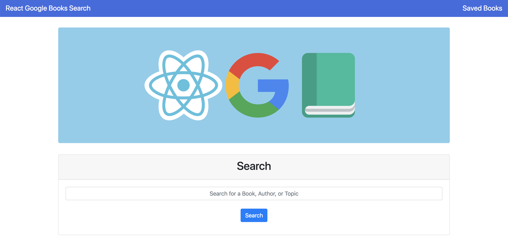

# React Google Books Search

Experience here: [React Google Books Search](https://serene-lowlands-44555.herokuapp.com/)

The React Google Books Search app is a MERN app that allows a user to search for books, authors, topics, and more on the Google Books API. The thumbnail image, authors, publish date, description, and link to the Google Books page are all displayed and accessible to the user. The user can also save the book &ndash; where they can view it a later time by clicking the Saved Books link in the Navbar. Once a book is saved, the user has the option to delete the book as well.

**Tech used:**
* React
* MongoDB
* Mongoose
* Express
* Node
* JavaScript
* Bootstrap
* Axios

&nbsp;

Designed, built, and maintained by Brian Fitzgerald

Email: brianjfitzgerald@gmail.com

Copyright &#169; 2019